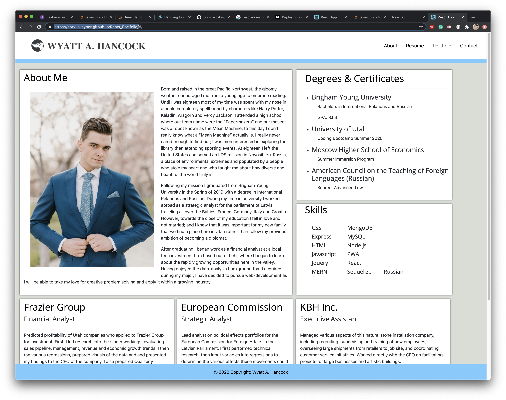
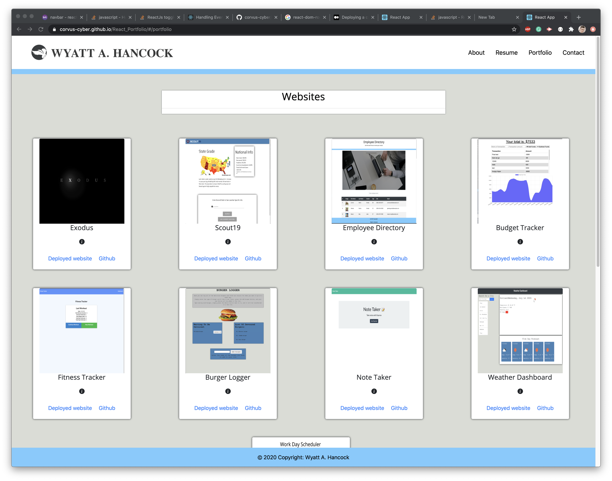
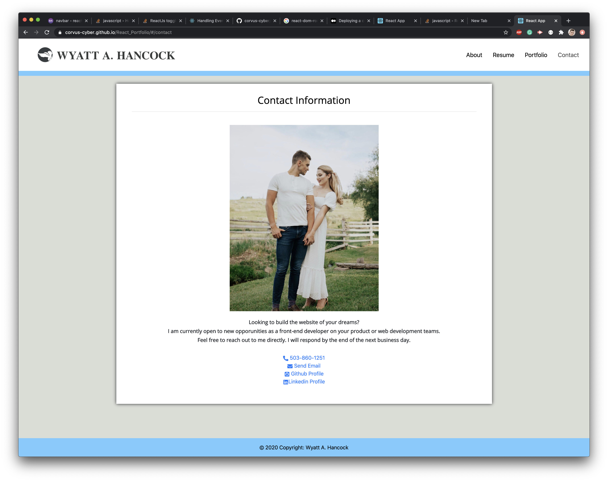

# React_Portfolio

# Table of Contents:
1. [Description](#Description)
2. [Process](#Process)
3. [Issues](#Issues)
4. [Mastered](#Mastered)
5. [Resources](#Rescources)
6. [Link](#Link)
7. [Screenshots](#Screenshots)
# Description:
Using React, I rebuilt my Portfolio that I have been refining over the last six months so that it would stand out from the competition by using React, JSV, and React-router-dom. By putting the necesscary information for my portfolio within a json container and passing it into a card via props, I was able to significantly dry up my code when compared with previous iterations.

# Process:
* After downloading react into a new repo, I began breaking down a earlier version of my resume that used traditional html and css, placing different pages into components and testing to see whether they'd run, changing things such as "class" into "className" so that it'd run in JSV.
* I then downloaded bootstrap into the app and checked to see whether the styling was continuing to work.
* From there I broke down the website into more managable components and sent the corresponding components to the appropriate pages, using react-router-dom to make it appear as if there were several pages in this one-page application. 
* After making sure that worked, I got rid of the repetetive code found in the portfolio page by creating a template for a card and placing all of the corresponding info for the card within an array in a .json file. Using props and .map I was able to create a new card for each object found within the .json file. 
    * From there I added an info button on the card, so that when clicked it would show the user details about the project and the technologies used.
    * The final thing was making sure that the image routing within the json file was correct so that I could have proper image deploy on each card. I did this by storing the images in the public folder, placing the routing within the json object, and then declaring 'process.env.PUBLIC_URL +' within the card's src. 
* Finally I made sure to clean up the code, removing unnessecary files and making sure the styling was to my taste. 

# Issues:
* The biggest issue by far was setting up dynamic routing so that the images for the portfolio cards would be properly displayed. As explained to me by Learning Assistant Katheryn, I needed to put the images within the public folder, and then call upon them in the json file where the routing info was being stored. One other thing that I later discovered when I tried to deploy my website was that I needed to add 'process.env.PUBLIC_URL +' into the image src that the image would show up in via props. 
* Another issue I ran across was that using the same function in jquery in different components could cause cross-interaction. This was the case with the card-reveal function that I built for the portfolio page so that the user could click and see all info about the application. On their own the components "CLA" and "Applications" worked perfectly fine, but when brought together on the page a click of the info button would cause the info to appear and disappear without giving the user a chance to read. In order to fix this I removed the jquery functions from the CLA component, which made it so that the functions were still operating on the page overall without causing any cross-interaction.  

# Mastered:
* React
* React-Router-Dom
* Props
* Component
* JSV

# Rescources: 
[How to build a toggle menu on react](https://stackoverflow.com/questions/52248179/how-to-use-data-toggle-collapse-in-reactjs-with-bootstrap)
* During office hours I was able to see fellow students Atima and Yakini  reveal cards function that they were using in order to display info upon clicking. I used said function in order to make my own cards operate in a similar manner

# Link:
[Deployed Website](https://corvus-cyber.github.io/React_Portfolio/)

# Screenshots:

